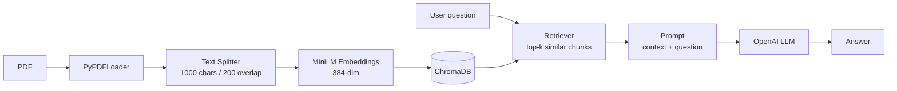

# 📄 DocChat: PDF Question Answering with RAG

Ask questions about a PDF in plain English and get answers grounded in the document, using **Retrieval-Augmented Generation (RAG)**.

---

## ✨ Features

- 📥 Loads PDF documents and splits them into overlapping chunks
- 🧠 Converts each chunk into a semantic vector with **all-MiniLM-L6-v2**
- 🗄️ Stores vectors in a persistent **ChromaDB** database
- 🔍 Retrieves the most relevant chunks for every question (semantic search)
- 💬 Interactive chat loop: keep asking questions, type `exit` to stop
- ✅ Answers only from the document context, which reduces hallucinations

---

## 🏗️ How It Works



1. **Data ingestion:** `PyPDFLoader` reads the PDF page by page.
2. **Chunking:** `RecursiveCharacterTextSplitter` splits the text into 1000-character chunks with 200 characters of overlap, so sentences at chunk edges are not lost.
3. **Embeddings:** each chunk is converted into a 384-dimensional vector with `sentence-transformers/all-MiniLM-L6-v2`. Chunks with similar meaning get similar vectors.
4. **Vector database:** the vectors are stored in **ChromaDB** (saved to `./chroma_db`, so the PDF only needs to be indexed once).
5. **Retrieval:** the question is embedded the same way, and the retriever finds the most similar chunks.
6. **Generation:** the retrieved chunks and the question are inserted into a prompt, and the **OpenAI LLM** writes an answer using only that context.

---

## 🛠️ Tech Stack

| Part | Tool |
|---|---|
| Framework | LangChain |
| PDF loading | PyPDFLoader |
| Text splitting | RecursiveCharacterTextSplitter |
| Embeddings | sentence-transformers/all-MiniLM-L6-v2 (Hugging Face) |
| Vector database | ChromaDB |
| LLM | OpenAI (via `langchain-openai`) |
| Environment | Jupyter Notebook |

---

## 🚀 Getting Started

### 1. Install the libraries
```bash
pip install langchain-core langchain-community langchain-text-splitters langchain-huggingface langchain-chroma langchain-openai pypdf sentence-transformers
```

### 2. Set your OpenAI API key
Never write the key inside the notebook. Set it in your terminal before starting Jupyter:

```bash
# Windows (PowerShell)
$env:OPENAI_API_KEY="your_key_here"

# Mac / Linux
export OPENAI_API_KEY="your_key_here"
```

### 3. Add your PDF
Put your PDF in the `data/` folder and update the path in the notebook:
```python
docs = PyPDFLoader("data/your_file.pdf").load()
```

### 4. Run the notebook
Run all cells, then chat with your document:
```
CHAT WITH ME: What are the disadvantages of the existing system?
```
Type `exit` to stop.

---

## 📁 Project Structure

```
├── document.ipynb     # full RAG pipeline (ingestion → chunking → embeddings → retrieval → answer)
├── data/              # your PDF files (not uploaded to GitHub)
├── chroma_db/         # saved vector database (created automatically, not uploaded)
└── README.md
```

---

## ⚠️ Limitations

- If the document uses different words than the question (e.g. *drawbacks* vs *limitations*), retrieval can miss the right chunk.
- Only answers from the retrieved chunks, so very broad questions ("summarise everything") may be incomplete.
- Text-only: images, charts and tables inside the PDF are not understood.

## 🔮 Future Improvements

- **Multi-query retrieval** to handle different wording
- Page-number citations in answers
- A web interface with Streamlit
- Multimodal support for images and charts → see my **[PDF Lens: Multimodal RAG](https://github.com/your-username/pdf-lens)** project
